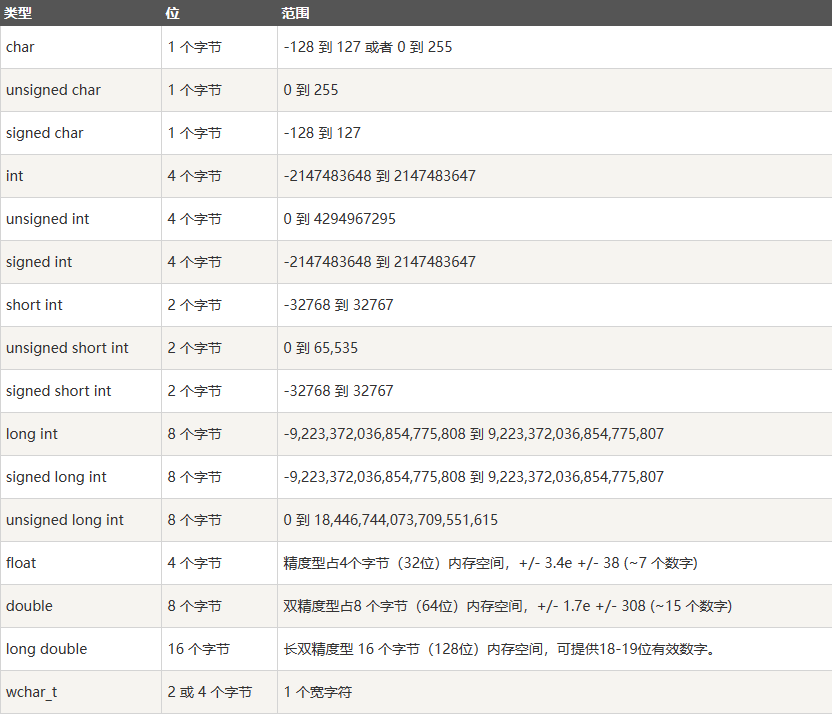

## [Readme教程](https://www.cnblogs.com/hezemin/p/16830829.html)
## [C++教程](https://www.runoob.com/cplusplus/cpp-tutorial.html)
## 基本语法
### hello world
```C++
+ cout<<"hello wolrd";
+ cout<<"hello world"<<endl;
+ cout<<"hello world"<< "\n";
std::cout << "hello world " << "hello C++" << std::endl;
```
### using namespace std
+ using namespace std; 告诉编译器使用 std 命名空间。命名空间是 C++ 中一个相对新的概念
### 三字符组
+ ??=	#
+ ??/	\
+ ??'	^
+ ??(	[
+ ??)	]
+ ??!	|
+ ??<	{
+ ??>	}
+ ??-	~
### 数据类型
+ 布尔型	bool
+ 字符型	char
+ 整型	    int
+ 浮点型	float
+ 双浮点型	double
+ 无类型	void
+ 宽字符型	wchar_t


### typedef 声明
+ typedef 为一个已有的类型取一个新的名字
```C++
typedef int feet;
feet distance;
```

### 类型转换
1. 静态转换
```C++
int i = 10;
float f = static_cast<float>(i); // 静态将int类型转换为float类型
```
2. 动态转换
```C++
class Base {};
class Derived : public Base {};
Base* ptr_base = new Derived;
Derived* ptr_derived = dynamic_cast<Derived*>(ptr_base); // 将基类指针转换为派生类指针
```
3. 常量转换
```C++
const int i = 10;
int& r = const_cast<int&>(i); // 常量转换，将const int转换为int
```
4. 重新解释转换
```C++
int i = 10;
float f = reinterpret_cast<float&>(i); // 重新解释将int类型转换为float类型
```
### 变量作用域
1. 初始化局部变量和全局变量
```C++
#include <iostream>

int main() {
    int a = 10;
    {
        int a = 20;  // 块作用域变量
        std::cout << "块变量: " << a << std::endl;
    }
    std::cout << "外部变量: " << a << std::endl;
    return 0;
}
```
2. 类作用域
```C++
#include <iostream>

class MyClass {
public:
    static int class_var;  // 类作用域变量
};

int MyClass::class_var = 30;

int main() {
    std::cout << "类变量: " << MyClass::class_var << std::endl;
    return 0;
}
```
### C++常量
#### 整型常量
+ 85         // 十进制
+ 0213       // 八进制 
+ 0x4b       // 十六进制 
+ 30         // 整数 
+ 30u        // 无符号整数 
+ 30l        // 长整数 
+ 30ul       // 无符号长整数
#### 浮点常量
+ 3.14159       // 合法的 
+ 314159E-5L    // 合法的 
+ 510E          // 非法的：不完整的指数
+ 210f          // 非法的：没有小数或指数
+ .e55          // 非法的：缺少整数或分数
#### 字符常量
+ \\	\ 字符
+ \'	' 字符
+ \"	" 字符
+ \?	? 字符
+ \a	警报铃声
+ \b	退格键
+ \f	换页符
+ \n	换行符
+ \r	回车
+ \t	水平制表符
+ \v	垂直制表符
+ \ooo	一到三位的八进制数
+ \xhh . . .	一个或多个数字的十六进制数
#### const 关键字
```C++
// const 定义常量，表示该变量的值不能被修改
const type variable = value;
```
### C++中的类型限定符
#### C++中的类型限定符
+ const	const 定义常量，表示该变量的值不能被修改。。
+ volatile	修饰符 volatile 告诉该变量的值可能会被程序以外的因素改变，如硬件或其他线程。。
+ restrict	由 restrict 修饰的指针是唯一一种访问它所指向的对象的方式。只有 C99 增加了新的类型限定符 restrict。
+ mutable	表示类中的成员变量可以在 const 成员函数中被修改。
+ static	用于定义静态变量，表示该变量的作用域仅限于当前文件或当前函数内，不会被其他文件或函数访问。
+ register	用于定义寄存器变量，表示该变量被频繁使用，可以存储在CPU的寄存器中，以提高程序的运行效率。
```C++
// const 实例
const int NUM = 10; // 定义常量 NUM，其值不可修改
const int* ptr = &NUM; // 定义指向常量的指针，指针所指的值不可修改
int const* ptr2 = &NUM; // 和上面一行等价
// volatile 实例
volatile int num = 20; // 定义变量 num，其值可能会在未知的时间被改变
// mutable 实例
class Example {
public:
    int get_value() const {
        return value_; // const 关键字表示该成员函数不会修改对象中的数据成员
    }
    void set_value(int value) const {
        value_ = value; // mutable 关键字允许在 const 成员函数中修改成员变量
    }
private:
    mutable int value_;
};
// static 实例
void example_function() {
    static int count = 0; // static 关键字使变量 count 存储在程序生命周期内都存在
    count++;
}
// register 实例
void example_function(register int num) {
    // register 关键字建议编译器将变量 num 存储在寄存器中
    // 以提高程序执行速度
    // 但是实际上是否会存储在寄存器中由编译器决定
}
```
### C++存储类

#### 1. auto存储类
+ auto 关键字用于两种情况：声明变量时根据初始化表达式自动推断该变量的类型、声明函数时函数返回值的占位符。
+ C++98标准中auto关键字用于自动变量的声明，但由于使用极少且多余，在 C++17 中已删除这一用法。
```C++
auto f=3.14;      //double
auto s("hello");  //const char*
auto z = new auto(9); // int*
auto x1 = 5, x2 = 5.0, x3='r';//错误，必须是初始化为同一类型
```
#### 2. register存储类
+ register 存储类用于定义存储在寄存器中而不是 RAM 中的局部变量。这意味着变量的最大尺寸等于寄存器的大小（通常是一个词），且不能对它应用一元的 '&' 运算符（因为它没有内存位置）。
```C++
{
   register int  miles;
}
```
#### 3. static存储类
+ static 存储类指示编译器在程序的生命周期内保持局部变量的存在，而不需要在每次它进入和离开作用域时进行创建和销毁。因此，使用 static 修饰局部变量可以在函数调用之间保持局部变量的值。
+ static 修饰符也可以应用于全局变量。当 static 修饰全局变量时，会使变量的作用域限制在声明它的文件内。
+ 在 C++ 中，当 static 用在类数据成员上时，会导致仅有一个该成员的副本被类的所有对象共享。
```C++
#include <iostream>
 
// 函数声明 
void func(void);
 
static int count = 10; /* 全局变量 */
 
int main()
{
    while(count--)
    {
       func();
    }
    return 0;
}
// 函数定义
void func( void )
{
    static int i = 5; // 局部静态变量
    i++;
    std::cout << "变量 i 为 " << i ;
    std::cout << " , 变量 count 为 " << count << std::endl;
}
// output:
// 变量 i 为 6 , 变量 count 为 9
// 变量 i 为 7 , 变量 count 为 8
// 变量 i 为 8 , 变量 count 为 7
// 变量 i 为 9 , 变量 count 为 6
// 变量 i 为 10 , 变量 count 为 5
// 变量 i 为 11 , 变量 count 为 4
// 变量 i 为 12 , 变量 count 为 3
// 变量 i 为 13 , 变量 count 为 2
// 变量 i 为 14 , 变量 count 为 1
// 变量 i 为 15 , 变量 count 为 0
```
#### 4. extern存储类
+ extern 存储类用于提供一个全局变量的引用，全局变量对所有的程序文件都是可见的。当您使用 'extern' 时，对于无法初始化的变量，会把变量名指向一个之前定义过的存储位置。
+ 当您有多个文件且定义了一个可以在其他文件中使用的全局变量或函数时，可以在其他文件中使用 extern 来得到已定义的变量或函数的引用。可以这么理解，extern 是用来在另一个文件中声明一个全局变量或函数。
+ extern 修饰符通常用于当有两个或多个文件共享相同的全局变量或函数的时候
```C++
// 第一个文件：main.cpp
#include <iostream>

int count ;
extern void write_extern();
 
int main()
{
   count = 5;
   write_extern();
}
```
```C++
// 第二个文件：support.cpp
#include <iostream>
 
extern int count;
 
void write_extern(void)
{
   std::cout << "Count is " << count << std::endl;
}
// $ g++ main.cpp support.cpp -o write
// $ ./write
// Count is 5
```
#### 5. mutable存储类
+ mutable 说明符仅适用于类的对象, 它允许对象的成员替代常量。也就是说, mutable 成员可以通过 const 成员函数修改。

#### 6. thread_local存储类
+ 使用 thread_local 说明符声明的变量仅可在它在其上创建的线程上访问。 变量在创建线程时创建，并在销毁线程时销毁。 每个线程都有其自己的变量副本。
+ thread_local 说明符可以与 static 或 extern 合并。
+ 可以将 thread_local 仅应用于数据声明和定义，thread_local 不能用于函数声明或定义。
```C++
thread_local int x;  // 命名空间下的全局变量
class X
{
    static thread_local std::string s; // 类的static成员变量
};
static thread_local std::string X::s;  // X::s 是需要定义的
 
void foo()
{
    thread_local std::vector<int> v;  // 本地变量
}
```
### C++运算符
#### 1. 算术运算符
|运算符 | 描述 | 实例
|--- | --- | ---
|+ | 把两个操作数相加 | A + B 将得到 30
|- | 从第一个操作数中减去第二个操作数 | A - B 将得到 -10
|* | 把两个操作数相乘 | A * B 将得到 200
|/ | 分子除以分母 | B / A 将得到 2
|% | 取模运算符，整除后的余数 | B % A 将得到 0
|++ | 自增运算符，整数值增加 1 | A++ 将得到 11
|-- | 自减运算符，整数值减少 1 | A-- 将得到 9

#### 2. 关系运算符
| 运算符 | 描述 | 实例
|--- | --- | ---
| == | 检查两个操作数的值是否相等，如果相等则条件为真。 | (A == B) 不为真。
| != | 检查两个操作数的值是否相等，如果不相等则条件为真。 | (A != B) 为真。
| > | 检查左操作数的值是否大于右操作数的值，如果是则条件为真。 | (A > B) 不为真。
| < | 检查左操作数的值是否小于右操作数的值，如果是则条件为真。 | (A < B) 为真。
| >= | 检查左操作数的值是否大于或等于右操作数的值，如果是则条件为真。 | (A >= B) 不为真。
| <= | 检查左操作数的值是否小于或等于右操作数的值，如果是则条件为真。 | (A <= B) 为真。

#### 3. 逻辑运算符
| 运算符 | 描述 | 实例
|--- | --- | ---
| && | 称为逻辑与运算符。如果两个操作数都 true，则条件为 true。| (A && B) 为 false。
|丨丨|称为逻辑或运算符。如果两个操作数中有任意一个 true，则条件为 true。| (A || B) 为 true。
| !  | 称为逻辑非运算符。用来逆转操作数的逻辑状态，如果条件为 true 则逻辑非运算符将使其为 false。| !(A && B) 为 true。

#### 4. 位运算
运算符 | 描述 | 实例
--- | --- | ---
& | 按位与操作，按二进制位进行"与"运算。运算规则：0&0=0; 0&1=0; 1&0=0; 1&1=1; | (A & B) 将得到 12，即为 0000 1100
| | 按位或运算符，按二进制位进行"或"运算。运算规则：0|0=0; 0|1=1; 1|0=1; 1|1=1; | (A | B) 将得到 61，即为 0011 1101
^ | 异或运算符，按二进制位进行"异或"运算。运算规则：0^0=0; 0^1=1; 1^0=1; 1^1=0; | (A ^ B) 将得到 49，即为 0011 0001
~ | 取反运算符，按二进制位进行"取反"运算。运算规则：~1=-2; ~0=-1; | (~A) 将得到 -61，即为 1100 0011，一个有符号二进制数的补码形式。
<< | 二进制左移运算符。将一个运算对象的各二进制位全部左移若干位（左边的二进制位丢弃，右边补0）。 | A << 2 将得到 240，即为 1111 0000
”>>“ | 二进制右移运算符。将一个数的各二进制位全部右移若干位，正数左补0，负数左补1，右边丢弃。 | A >> 2 将得到 15，即为 0000 1111
```C++
#include <iostream>
using namespace std;
 
int main()
{
   unsigned int a = 60;      // 60 = 0011 1100  
   unsigned int b = 13;      // 13 = 0000 1101
   int c = 0;           
 
   c = a & b;             // 12 = 0000 1100
   cout << "Line 1 - c 的值是 " << c << endl ;
 
   c = a | b;             // 61 = 0011 1101
   cout << "Line 2 - c 的值是 " << c << endl ;
 
   c = a ^ b;             // 49 = 0011 0001
   cout << "Line 3 - c 的值是 " << c << endl ;
 
   c = ~a;                // -61 = 1100 0011
   cout << "Line 4 - c 的值是 " << c << endl ;
 
   c = a << 2;            // 240 = 1111 0000
   cout << "Line 5 - c 的值是 " << c << endl ;
 
   c = a >> 2;            // 15 = 0000 1111
   cout << "Line 6 - c 的值是 " << c << endl ;
 
   return 0;
}
```
#### 5. 赋值运算
运算符 | 描述 | 实例
--- | --- | ---
=	|简单的赋值运算符，把右边操作数的值赋给左边操作数|	C = A + B 将把 A + B 的值赋给 C
+=	|加且赋值运算符，把右边操作数加上左边操作数的结果赋值给左边操作数|	C += A 相当于 C = C + A
-=	|减且赋值运算符，把左边操作数减去右边操作数的结果赋值给左边操作数|	C -= A 相当于 C = C - A
*=	|乘且赋值运算符，把右边操作数乘以左边操作数的结果赋值给左边操作数|	C *= A 相当于 C = C * A
/=	|除且赋值运算符，把左边操作数除以右边操作数的结果赋值给左边操作数|	C /= A 相当于 C = C / A
%=	|求模且赋值运算符，求两个操作数的模赋值给左边操作数	C %= A 相当于| C = C % A
<<=	|左移且赋值运算符|	C <<= 2 等同于 C = C << 2
“>>=”	|右移且赋值运算符|	C >>= 2 等同于 C = C >> 2
&=	|按位与且赋值运算符|	C &= 2 等同于 C = C & 2
^=	|按位异或且赋值运算符|	C ^= 2 等同于 C = C ^ 2
|=	|按位或且赋值运算符|	C |= 2 等同于 C = C | 2
```C++
#include <iostream>
using namespace std;
 
int main()
{
   int a = 21;
   int c ;
 
   c =  a;
   cout << "Line 1 - =  运算符实例，c 的值 = : " <<c<< endl ;
 
   c +=  a;
   cout << "Line 2 - += 运算符实例，c 的值 = : " <<c<< endl ;
 
   c -=  a;
   cout << "Line 3 - -= 运算符实例，c 的值 = : " <<c<< endl ;
 
   c *=  a;
   cout << "Line 4 - *= 运算符实例，c 的值 = : " <<c<< endl ;
 
   c /=  a;
   cout << "Line 5 - /= 运算符实例，c 的值 = : " <<c<< endl ;
 
   c  = 200;
   c %=  a;
   cout << "Line 6 - %= 运算符实例，c 的值 = : " <<c<< endl ;
 
   c <<=  2;
   cout << "Line 7 - <<= 运算符实例，c 的值 = : " <<c<< endl ;
 
   c >>=  2;
   cout << "Line 8 - >>= 运算符实例，c 的值 = : " <<c<< endl ;
 
   c &=  2;
   cout << "Line 9 - &= 运算符实例，c 的值 = : " <<c<< endl ;
 
   c ^=  2;
   cout << "Line 10 - ^= 运算符实例，c 的值 = : " <<c<< endl ;
 
   c |=  2;
   cout << "Line 11 - |= 运算符实例，c 的值 = : " <<c<< endl ;
 
   return 0;
}
```
#### 6. 杂项运算
| 运算符 | 描述 |
| --- | --- |
| sizeof | sizeof 运算符返回变量的大小。例如，sizeof(a) 将返回 4，其中 a 是整数。 |
| Condition ? X : Y | 条件运算符。如果 Condition 为真 ? 则值为 X : 否则值为 Y。 |
| , | 逗号运算符会顺序执行一系列运算。整个逗号表达式的值是以逗号分隔的列表中的最后一个表达式的值。 |
| .（点）和 ->（箭头） | 成员运算符用于引用类、结构和共用体的成员。 |
| Cast | 强制转换运算符把一种数据类型转换为另一种数据类型。例如，int(2.2000) 将返回 2。 |
| & | 指针运算符 & 返回变量的地址。例如 &a; 将给出变量的实际地址。 |
| * | 指针运算符 * 指向一个变量。例如，*var; 将指向变量 var。 |
#### 7. 运算符优先级
| 类别 | 运算符 | 结合性 |
| --- | --- | --- |
| 后缀 | () [] -> . ++ - - | 从左到右 |
| 一元 | + - ! ~ ++ - - (type)* & sizeof | 从右到左 |
| 乘除 | * / % | 从左到右 |
| 加减 | + - | 从左到右 |
| 移位 | << >> | 从左到右 |
| 关系 | < <= > >= | 从左到右 |
| 相等 | == != | 从左到右 |
| 位与 AND | & | 从左到右 |
| 位异或 XOR | ^ | 从左到右 |
| 位或 OR | | 从左到右 |
| 逻辑与 AND | && | 从左到右 |
| 逻辑或 OR | || | 从左到右 |
| 条件 | ?: | 从右到左 |
| 赋值 | = += -= *= /= %=>>= <<= &= ^= |= | 从右到左 |
| 逗号 | , | 从左到右 |
### C++数字
#### 1. C++数学运算
| 序号 | 函数 & 描述 |
| ---- | ----------- |
| 1    | double cos(double); 该函数返回弧度角（double 型）的余弦。 |
| 2    | double sin(double); 该函数返回弧度角（double 型）的正弦。 |
| 3    | double tan(double); 该函数返回弧度角（double 型）的正切。 |
| 4    | double log(double); 该函数返回参数的自然对数。 |
| 5    | double pow(double, double); 假设第一个参数为 x，第二个参数为 y，则该函数返回 x 的 y 次方。 |
| 6    | double hypot(double, double); 该函数返回两个参数的平方总和的平方根，也就是说，参数为一个直角三角形的两个直角边，函数会返回斜边的长度。 |
| 7    | double sqrt(double); 该函数返回参数的平方根。 |
| 8    | int abs(int); 该函数返回整数的绝对值。 |
| 9    | double fabs(double); 该函数返回任意一个浮点数的绝对值。 |
| 10   | double floor(double); 该函数返回一个小于或等于传入参数的最大整数。 |
```C++
#include <iostream>
#include <cmath>
using namespace std;
 
int main ()
{
   // 数字定义
   short  s = 10;
   int    i = -1000;
   long   l = 100000;
   float  f = 230.47;
   double d = 200.374;
 
   // 数学运算
   cout << "sin(d) :" << sin(d) << endl;
   cout << "abs(i)  :" << abs(i) << endl;
   cout << "floor(d) :" << floor(d) << endl;
   cout << "sqrt(f) :" << sqrt(f) << endl;
   cout << "pow( d, 2) :" << pow(d, 2) << endl;
 
   return 0;
}
```
#### 2. C++随机数
+ 在许多情况下，需要生成随机数。关于随机数生成器，有两个相关的函数。一个是 rand()，该函数只返回一个伪随机数。生成随机数之前必须先调用 srand() 函数。
```C++
// 下面是一个关于生成随机数的简单实例。实例中使用了 time() 函数来获取系统时间的秒数，通过调用 rand() 函数来生成随机数：
#include <iostream>
#include <ctime>
#include <cstdlib>
 
using namespace std;
 
int main ()
{
   int i,j;
 
   // 设置种子
   srand( (unsigned)time( NULL ) );
 
   /* 生成 10 个随机数 */
   for( i = 0; i < 10; i++ )
   {
      // 生成实际的随机数
      j= rand();
      cout <<"随机数： " << j << endl;
   }
 
   return 0;
}
```
### C++数组
#### 1. 一维数组
1. 声明数组
+ type arrayName [ arraySize ];
2. 初始化数组
+ double balance[5] = {1000.0, 2.0, 3.4, 7.0, 50.0};
+ double balance[] = {1000.0, 2.0, 3.4, 7.0, 50.0};
```C++
#include <iostream>
using namespace std;
 
#include <iomanip>
using std::setw;
 
int main ()
{
   int n[ 10 ]; // n 是一个包含 10 个整数的数组
 
   // 初始化数组元素          
   for ( int i = 0; i < 10; i++ )
   {
      n[ i ] = i + 100; // 设置元素 i 为 i + 100
   }
   cout << "Element" << setw( 13 ) << "Value" << endl;
 
   // 输出数组中每个元素的值                     
   for ( int j = 0; j < 10; j++ )
   {
      cout << setw( 7 )<< j << setw( 13 ) << n[ j ] << endl;
   }
 
   return 0;
}
```
#### 2. 多维数组
1. 定义
+ type arrayName [ x ][ y ];
2. 初始化
+ int a[3][4] = {0,1,2,3,4,5,6,7,8,9,10,11};
```C++
#include <iostream>
using namespace std;
 
int main ()
{
   // 一个带有 5 行 2 列的数组
   int a[5][2] = { {0,0}, {1,2}, {2,4}, {3,6},{4,8}};
 
   // 输出数组中每个元素的值                      
   for ( int i = 0; i < 5; i++ )
      for ( int j = 0; j < 2; j++ )
      {
         cout << "a[" << i << "][" << j << "]: ";
         cout << a[i][j]<< endl;
      }
 
   return 0;
}
```
### C++字符串
#### 1. C风格字符串
+ char site[7] = {'R', 'U', 'N', 'O', 'O', 'B', '\0'};
+ char site[] = "RUNOOB";
```C++
#include <iostream>
 
using namespace std;
 
int main ()
{
   char site[7] = {'R', 'U', 'N', 'O', 'O', 'B', '\0'};
 
   cout << "菜鸟教程: ";
   cout << site << endl;
 
   return 0;
}
```
#### 2. C++引入的字符串函数
1. strcpy(s1, s2);
复制字符串 s2 到字符串 s1。
2. strcat(s1, s2);
连接字符串 s2 到字符串 s1 的末尾。连接字符串也可以用 + 号
3.	strlen(s1);
返回字符串 s1 的长度。
4.	strcmp(s1, s2);
如果 s1 和 s2 是相同的，则返回 0；如果 s1<s2 则返回值小于 0；如果 s1>s2 则返回值大于 0。
5.	strchr(s1, ch);
返回一个指针，指向字符串 s1 中字符 ch 的第一次出现的位置。
6.	strstr(s1, s2);
返回一个指针，指向字符串 s1 中字符串 s2 的第一次出现的位置。
```C++
#include <iostream>
#include <cstring>
 
using namespace std;
 
int main ()
{
   char str1[13] = "runoob";
   char str2[13] = "google";
   char str3[13];
   int  len ;
 
   // 复制 str1 到 str3
   strcpy( str3, str1);
   cout << "strcpy( str3, str1) : " << str3 << endl;
 
   // 连接 str1 和 str2
   strcat( str1, str2);
   cout << "strcat( str1, str2): " << str1 << endl;
 
   // 连接后，str1 的总长度
   len = strlen(str1);
   cout << "strlen(str1) : " << len << endl;
 
   return 0;
}
```
#### 3. C++中的String类
```C++
#include <iostream>
#include <string>
 
using namespace std;
 
int main ()
{
   string str1 = "runoob";
   string str2 = "google";
   string str3;
   int  len ;
 
   // 复制 str1 到 str3
   str3 = str1;
   cout << "str3 : " << str3 << endl;
 
   // 连接 str1 和 str2
   str3 = str1 + str2;
   cout << "str1 + str2 : " << str3 << endl;
 
   // 连接后，str3 的总长度
   len = str3.size();
   cout << "str3.size() :  " << len << endl;
 
   return 0;
}
```
### C++指针
#### 1. C++Null指针
+ 在变量声明的时候，如果没有确切的地址可以赋值，为指针变量赋一个 NULL 值是一个良好的编程习惯。赋为 NULL 值的指针被称为空指针。
```C++
#include <iostream>

using namespace std;

int main ()
{
   int  *ptr = NULL;

   cout << "ptr 的值是 " << ptr ;
 
   return 0;
}
```
+ 内存地址 0 有特别重要的意义，它表明该指针不指向一个可访问的内存位置。但按照惯例，如果指针包含空值（零值），则假定它不指向任何东西。如需检查一个空指针，您可以使用 if 语句，如下所示：
```C++
if(ptr)     /* 如果 ptr 非空，则完成 */
if(!ptr)    /* 如果 ptr 为空，则完成 */
```
#### 2. C++从函数返回指针
+ C++ 不支持在函数外返回局部变量的地址，除非定义局部变量为 static变量
```C++
#include <iostream>
#include <ctime>
#include <cstdlib>

using namespace std;
// 要生成和返回随机数的函数
int *getRandom()
{
   static int r[10];
   // 设置种子
   srand((unsigned)time(NULL));
   for (int i = 0; i < 10; ++i)
   {
      r[i] = rand();
      cout << r[i] << endl;
   }

   return r;
}

// 要调用上面定义函数的主函数
int main()
{
   // 一个指向整数的指针
   int *p;

   p = getRandom();
   for (int i = 0; i < 10; i++)
   {
      cout << "*(p + " << i << ") : ";
      cout << *(p + i) << endl;
   }

   return 0;
}
```
### C++引用
+ 引用变量是一个别名，也就是说，它是某个已存在变量的另一个名字。一旦把引用初始化为某个变量，就可以使用该引用名称或变量名称来指向变量。
```C++
#include <iostream>
 
using namespace std;
 
int main ()
{
   // 声明简单的变量
   int    i;
   double d;
 
   // 声明引用变量
   int&    r = i;
   double& s = d;
   
   i = 5;
   cout << "Value of i : " << i << endl;
   cout << "Value of i reference : " << r  << endl;
 
   d = 11.7;
   cout << "Value of d : " << d << endl;
   cout << "Value of d reference : " << s  << endl;
   
   return 0;
}
```
#### 1. C++把引用作为参数
```C++
#include <iostream>
using namespace std;
 
// 函数声明
void swap(int& x, int& y);
 
int main ()
{
   // 局部变量声明
   int a = 100;
   int b = 200;
 
   cout << "交换前，a 的值：" << a << endl;
   cout << "交换前，b 的值：" << b << endl;
 
   /* 调用函数来交换值 */
   swap(a, b);
 
   cout << "交换后，a 的值：" << a << endl;
   cout << "交换后，b 的值：" << b << endl;
 
   return 0;
}
 
// 函数定义
void swap(int& x, int& y)
{
   int temp;
   temp = x; /* 保存地址 x 的值 */
   x = y;    /* 把 y 赋值给 x */
   y = temp; /* 把 x 赋值给 y  */
  
   return;
}
```
#### 2. C++把引用作为返回值
```C++
#include <iostream>
 
using namespace std;
 
double vals[] = {10.1, 12.6, 33.1, 24.1, 50.0};
 
double& setValues(int i)
{  
   double& ref = vals[i];    
   return ref;   // 返回第 i 个元素的引用，ref 是一个引用变量，ref 引用 vals[i]
}
 
// 要调用上面定义函数的主函数
int main ()
{
 
   cout << "改变前的值" << endl;
   for ( int i = 0; i < 5; i++ )
   {
       cout << "vals[" << i << "] = ";
       cout << vals[i] << endl;
   }
 
   setValues(1) = 20.23; // 改变第 2 个元素
   setValues(3) = 70.8;  // 改变第 4 个元素
 
   cout << "改变后的值" << endl;
   for ( int i = 0; i < 5; i++ )
   {
       cout << "vals[" << i << "] = ";
       cout << vals[i] << endl;
   }
   return 0;
}
```
### C++日期&时间
